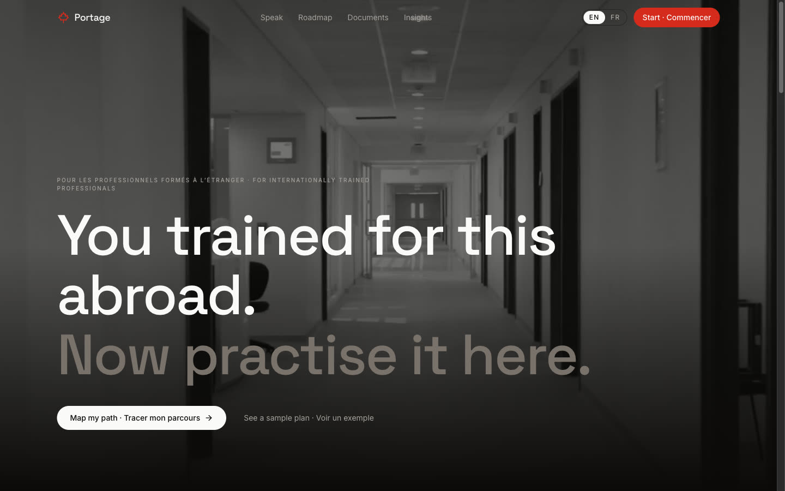
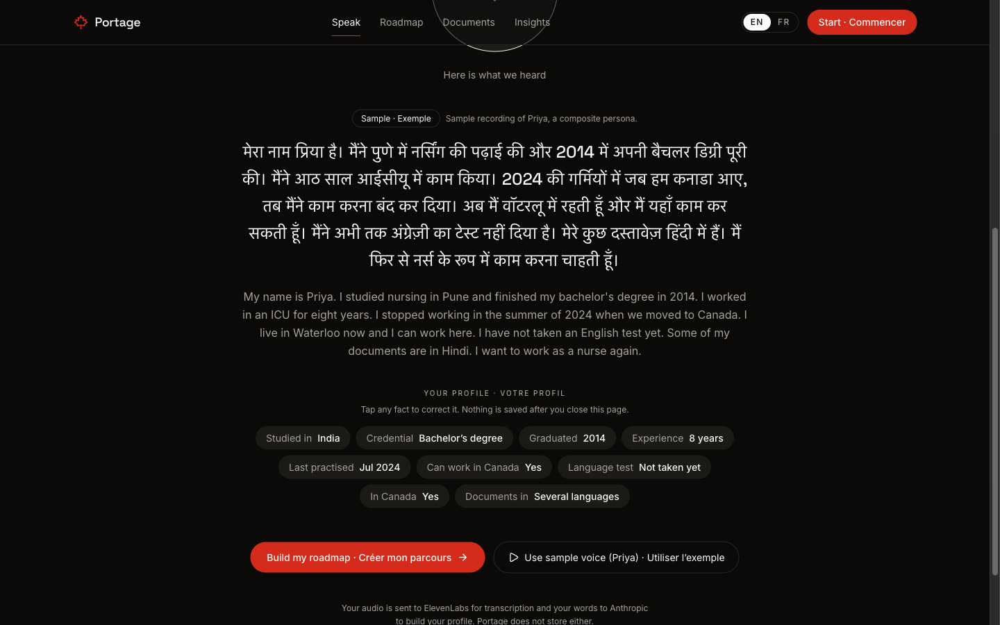
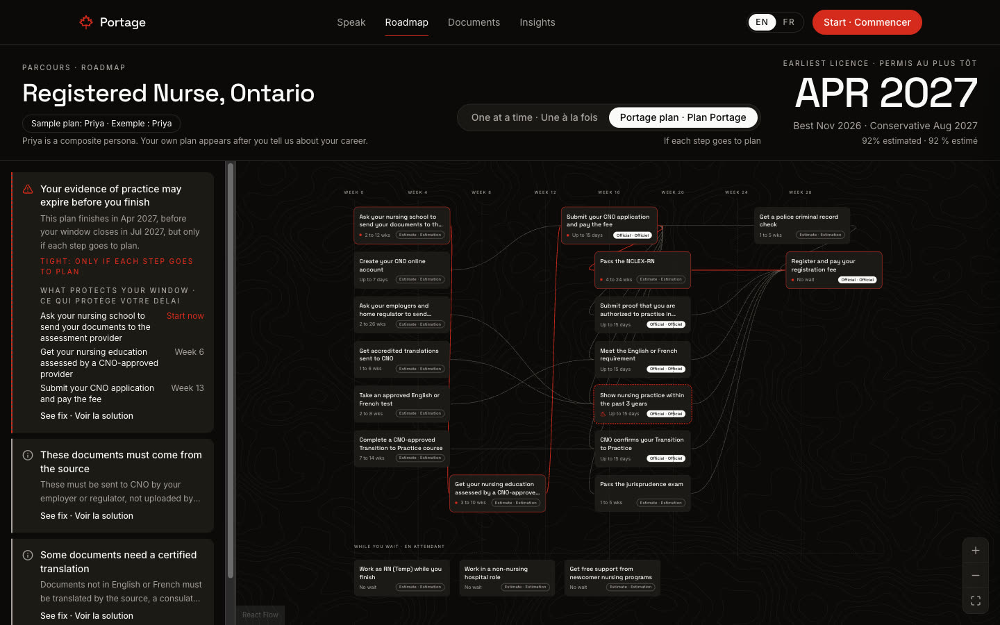
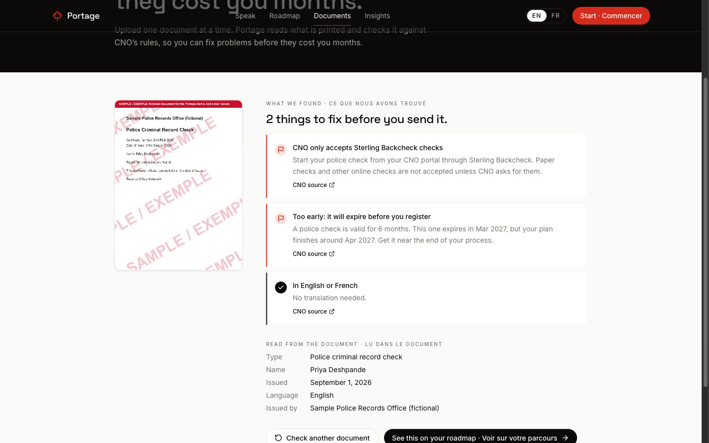
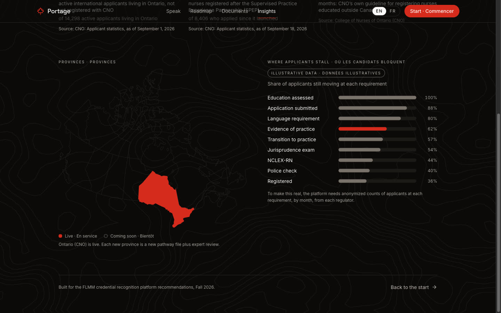

# Portage

> Carry your career across. / Emportez votre carrière avec vous.

**Portage turns the licensing maze for internationally educated professionals into a personal, cited, deadline-aware roadmap, starting with internationally educated nurses becoming Registered Nurses in Ontario.**

- Live: `LIVE_URL`
- Demo video: `VIDEO_URL`
- Walk-through without keys or network: add `?demo=1` to any page (for example `LIVE_URL/?demo=1`).

## The problem

Canada needs nurses, and thousands of internationally educated nurses already live here: the College of Nurses of Ontario (CNO) lists 7,957 active international applicants living in Ontario who are not yet registered (as of September 1, 2026). Registering means meeting nine separate requirements across CNO, schools, assessment providers, test centres and police, and CNO's own guideline is about 12 months. There is no single place that shows *your* path, in the right order, with the deadlines that can quietly reset months of progress.

## What it does



1. **Landing (`/`)**: the promise, how it works, and three sourced numbers.
2. **Speak (`/start`)**: tell your story out loud in any language; see the transcript, an English translation, and editable profile facts.
3. **Roadmap (`/roadmap`)**: every CNO step for *your* profile, one at a time versus the Portage plan (steps in parallel), with the earliest licence date, official sources on every step, and deadline warnings (for the sample persona, her evidence of practice expires if she does one step at a time; on the Portage plan she keeps it, but only if each step goes to plan).
4. **Documents (`/documents`)**: upload a document; Portage reads what is printed and checks it against CNO's rules (who must send it, validity windows, translation, names).
5. **Insights (`/insights`)**: for governments and regulators, where applicants are and where they stall, with real CNO numbers and a clearly labelled illustrative funnel.

| | |
|---|---|
|  |  |
|  |  |

## AI versus the deterministic engine

- **The AI only reads.** ElevenLabs Scribe transcribes speech. Claude (forced tool use, validated with zod) extracts a structured profile from what the person said, and extracts the fields printed on an uploaded document. It never invents requirements, fees, timelines or rules.
- **The plan is deterministic.** `buildPlan(profile, pathway, today)` in `src/lib/engine/` runs in the browser on a versioned, cited data file: applicability rules, a one-at-a-time schedule, a critical-path (parallel) schedule with best / typical / conservative ranges, and deadline warnings evaluated per schedule. It is pure and covered by golden tests (three personas) and property tests.
- **Document findings are rules, not model output** (`src/lib/engine/docRules.ts`).
- **Every AI call has a fixture fallback**, so the demo cannot die on venue wifi (`?demo=1`, a missing key, a timeout, or any upstream error).

## Data sources

- Official CNO pages for every requirement, fee and processing time; every step in `src/data/pathways/on-rn-ien.json` carries its source URLs and an access date. Verification notes: [`docs/PATHWAY_VERIFIED.md`](docs/PATHWAY_VERIFIED.md); research base: [`docs/PATHWAY_ON_RN_IEN.md`](docs/PATHWAY_ON_RN_IEN.md).
- CNO applicant statistics (active applicants and SPEP outcomes) for the insights view, with as-of dates.
- Map: Natural Earth admin-1 (public domain). Hero footage: Pexels. See [`docs/CREDITS.md`](docs/CREDITS.md).

## Honesty notes

- Durations marked **Estimate · Estimation** are applicant-side time with a note on where the number came from; **Official · Officiel** durations come from CNO's published processing times.
- Every timeline is a range; the Portage plan is labelled "if each step goes to plan".
- The insights stage funnel is **Illustrative data · Données illustratives**; there is no public per-stage data yet.
- Sample documents are watermarked **SAMPLE / EXEMPLE**. Priya is a composite persona.
- Portage never asks for a regulator login and never submits anything. Always confirm with the regulator.

## Tech stack

Next.js (App Router, TypeScript), React 19, Tailwind CSS v4, GSAP (`@gsap/react`, ScrollTrigger), React Flow (`@xyflow/react`), zustand, zod, Anthropic SDK and ElevenLabs REST (server routes only), Vitest, pnpm, Vercel.

## Run locally

```bash
pnpm i
cp .env.example .env.local   # add ANTHROPIC_API_KEY and ELEVENLABS_API_KEY (optional)
pnpm dev                     # http://localhost:3000
```

- Without keys every AI route serves fixtures; open any page with `?demo=1` to force demo mode. `?reset=1` clears the in-memory profile.
- `pnpm test` (unit tests), `pnpm lint`, `pnpm build`.
- `pnpm smoke <baseUrl>` checks every page and the profile route in demo mode.

## Team

Taha Hussain and Ebrahim Zuberi. Built at the Ascendance Foundry Hackathon, Waterloo, September 26 to 27, 2026.
